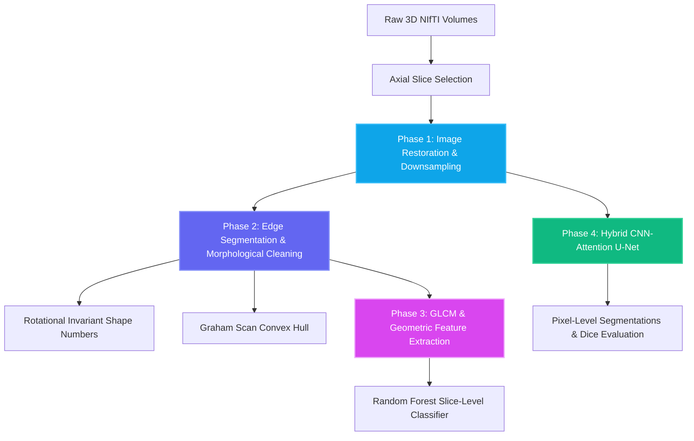
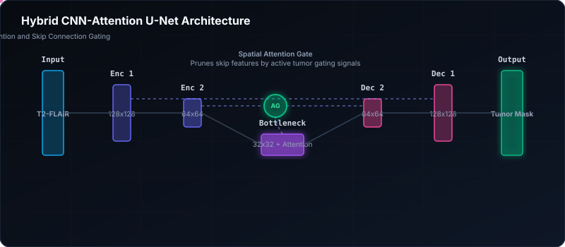

# Multimodal Brain MRI Processing &amp; Deep Vision Pipeline

<p align="center">
  
</p>

<p align="center">
  <a href="https://github.com/shahrukhfu/brain-mri-analysis-deep-vision-pipeline"></a>
  <a href="https://github.com/shahrukhfu/brain-mri-analysis-deep-vision-pipeline"></a>
  <a href="https://github.com/shahrukhfu/brain-mri-analysis-deep-vision-pipeline"></a>
  <a href="https://github.com/shahrukhfu/brain-mri-analysis-deep-vision-pipeline"></a>
  <a href="https://github.com/shahrukhfu/brain-mri-analysis-deep-vision-pipeline"></a>
</p>

---

## Table of Contents
<p align="center">
  <b><a href="#project-overview">Project Overview</a></b> • 
  <b><a href="#pipeline-phases">Pipeline Phases</a></b> • 
  <b><a href="#deliverables--results-visualizations">Results &amp; Visualizations</a></b> • 
  <b><a href="#directory-structure">Directory Structure</a></b> • 
  <b><a href="#setup--running-the-pipeline">Setup &amp; Running</a></b>
</p>

---

## Project Overview

This repository implements an end-to-end medical image processing and deep learning pipeline applied to the **Brain Tumor Segmentation (BraTS) pediatric dataset** (25 patients). The pipeline integrates spatial domain restoration, boundary chain coding, computational geometry (custom Graham Scan convex hulls), statistical texture analysis (GLCM), and semantic segmentation utilizing a hybrid **CNN-Attention U-Net** architecture.

> [!NOTE]
> The primary focus of this research is comparing classical computational geometry / texture classifiers with modern deep-learning-based segmentation on multimodal brain MRI scans.



---

## Pipeline Phases

<details open>
<summary><b>Phase 1: Spatial Domain Restoration &amp; Anti-Aliasing</b></summary>
<br>

* **Objective**: Denoise raw axial MRI slices containing high sensor noise without corrupting structural tumor boundaries.
* **Methods**:
  - Simulates Gaussian and Salt-and-Pepper noise profiles.
  - Implements Gaussian, Mean, and Median 2D filtering.
  - Addresses anti-aliasing during downsampling through Gaussian pre-filtering to protect against checkerboard/aliasing artifacts.

</details>

<details>
<summary><b>Phase 2: Edge-Guided Segmentation &amp; Convex Hulls</b></summary>
<br>

* **Objective**: Segment tumor region boundaries and extract structural descriptors.
* **Methods**:
  - Applies threshold-guided Canny edge detection followed by morphological cleaning using an ellipsoidal structuring element.
  - Traces contours to compute **8-directional boundary chain codes**, first differences, and rotationally invariant shape numbers.
  - Constructs the **Convex Hull** surrounding the tumor contour using a custom, from-scratch **Graham Scan** algorithm ($O(N \log N)$ complexity).

</details>

<details>
<summary><b>Phase 3: GLCM Feature Extraction &amp; Traditional ML</b></summary>
<br>

* **Objective**: Classify slices as Malignant vs. Benign based on statistical and geometric descriptors.
* **Methods**:
  - Extracts 8 geometric shape descriptors (area, eccentricity, perimeter, hull ratio, etc.).
  - Computes Gray-Level Co-occurrence Matrix (GLCM) statistical features (Energy, Contrast, Entropy) at distance $d=1$ across four orientations ($0^\circ, 45^\circ, 90^\circ, 135^\circ$).
  - Trains a Random Forest Classifier evaluated using 5-Fold Cross-Validation.

</details>

<details>
<summary><b>Phase 4: Hybrid CNN-Attention U-Net Segmentation</b></summary>
<br>

* **Objective**: Perform pixel-level segmentation of the brain tumor.
* **Methods**:
  - Integrates a spatial self-attention block (Attention Gate) at the encoder-decoder skip connections to focus network weights on irregular tumor shapes and suppress background activations.
  - Trained on T2-FLAIR and T1-contrast enhanced slices.

</details>

---

## Deliverables &amp; Results Visualizations

### 1. Image Restoration Metrics (Phase 1)
The spatial filters are evaluated below. A comparison of Peak Signal-to-Noise Ratio (PSNR) and Structural Similarity Index (SSIM) indicates that the **Median filter** is superior for Salt-and-Pepper noise, while the **Gaussian filter** provides optimal noise reduction for Gaussian sensor noise.

| Metric / Noise Profile | Filter Applied | PSNR (dB) | Relative Strength (PSNR) | SSIM | Relative SSIM |
| :--- | :--- | :---: | :--- | :---: | :--- |
| **Noisy** Gaussian ($\sigma^2=0.01$) | None | 21.98 | `███████░░░` | 0.2694 | `███░░░░░░░` |
| **Restored** Gaussian ($\sigma^2=0.01$) | **Gaussian ($5 \times 5, \sigma=1.0$)** | **26.46** | `█████████░` | 0.5054 | `█████░░░░░` |
| **Restored** Gaussian ($\sigma^2=0.01$) | Mean ($5 \times 5$) | 24.97 | `████████░░` | **0.5100** | `█████░░░░░` |
| **Noisy** Salt-and-Pepper (2%) | None | 20.62 | `███████░░░` | 0.6676 | `███████░░░` |
| **Restored** Salt-and-Pepper (2%) | **Median ($5 \times 5$)** | **28.43** | `██████████` | **0.9201** | `█████████░` |

---

### 2. Edge-Guided Segmentation &amp; Graham Scan (Phase 2)
The custom Graham Scan algorithm constructs a Convex Hull around the segmented tumor contour. Below is a real-time visualization of the algorithm sorting and validating vertices, followed by a sample output on patient slice `BraTS-PED-00075-000`.

<p align="center">
  
  <br>
  <em>Visualization: Sorting vertices by polar angle and popping right-turns (non-convex vertices)</em>
</p>

<p align="center">
  
  <br>
  <em>Figure 1: Traced tumor boundary contour (Gray) vs Computed Graham Scan Convex Hull (White)</em>
</p>

---

### 3. GLCM Descriptors &amp; Classifier Performance (Phase 3)
Extracts 8 geometric and Gray-Level Co-occurrence Matrix (GLCM) statistical features across orientations. A Random Forest classifier categorizes tumor slices.

> [!TIP]
> **Mean Cross-Validation Accuracy**: **92.00%**

#### Traditional Classifier Metrics
```text
  ● Benign Class:    Precision: 0.93  |  Recall: 0.93  |  F1-Score: 0.93  (Support: 14)
  ● Malignant Class: Precision: 0.91  |  Recall: 0.91  |  F1-Score: 0.91  (Support: 11)
```

---

### 4. Semantic Segmentation via Hybrid CNN-Attention U-Net (Phase 4)
Integrates a spatial self-attention block at the skip connections to filter noisy background features and select only relevant tumor features.

<p align="center">
  
</p>

#### DL Performance Dashboard
* **Dice Coefficient (F1-Score)**: **0.5037**
* **Recall (Sensitivity)**: **0.8033**
* **Precision**: **0.3669**

<p align="center">
  
  <br>
  <em>Figure 2: Side-by-side segmentation output: Input Slice (Left), Ground-Truth Mask (Middle), CNN-Attention U-Net Prediction (Right)</em>
</p>

<details>
<summary><b>View Phase 4 Validation Confusion Matrix</b></summary>
<br>

The model shows a high sensitivity (0.8033) for locating tumor regions, which is preferred in clinical screenings to minimize missed diagnoses (False Negatives).

<table align="center" style="margin: 0 auto; text-align: center; border-collapse: collapse;">
  <tr>
    <th colspan="2" rowspan="2" style="border: 1px solid #334155; padding: 10px;"></th>
    <th colspan="2" style="border: 1px solid #334155; padding: 10px; background-color: #0f172a;"><b>Ground Truth</b></th>
  </tr>
  <tr>
    <td style="border: 1px solid #334155; padding: 10px; background-color: #1e293b;"><b>Tissue / Benign (Negative)</b></td>
    <td style="border: 1px solid #334155; padding: 10px; background-color: #1e293b;"><b>Tumor (Positive)</b></td>
  </tr>
  <tr>
    <th rowspan="2" style="border: 1px solid #334155; padding: 10px; background-color: #0f172a; vertical-align: middle;">Prediction</th>
    <td style="border: 1px solid #334155; padding: 10px; background-color: #1e293b;"><b>Negative</b></td>
    <td style="border: 1px solid #334155; padding: 10px; background-color: #0f172a; color: #10b981;"><b>TN (True Negative)</b><br>108,394 (96.2%)</td>
    <td style="border: 1px solid #334155; padding: 10px; background-color: #7f1d1d; color: #fca5a5;"><b>FN (False Negative)</b><br>519 (0.5%)</td>
  </tr>
  <tr>
    <td style="border: 1px solid #334155; padding: 10px; background-color: #1e293b;"><b>Positive</b></td>
    <td style="border: 1px solid #334155; padding: 10px; background-color: #7c2d12; color: #fdba74;"><b>FP (False Positive)</b><br>3,656 (3.2%)</td>
    <td style="border: 1px solid #334155; padding: 10px; background-color: #064e3b; color: #6ee7b7;"><b>TP (True Positive)</b><br>2,119 (1.9%)</td>
  </tr>
</table>

</details>

---

## Directory Structure

```text
├── assets/                     # SVG Animations and banners
│   ├── banner.svg              # Main tech banner
│   ├── graham_scan_animation.svg   # Graham scan process flow
│   └── attention_unet_animation.svg # Hybrid U-Net structure
├── before_after_dataset/       # Visual pipeline comparisons
│   ├── original/               # Raw axial slices
│   ├── filtered/               # Denoised MRI slices
│   ├── downsampled/            # Decimated slices (with/without AA)
│   ├── segmented/              # Morphological masks & DL predictions
│   └── convex_hull/            # Custom Graham Scan overlays
├── scratch/                    # Data dependencies and cached files
│   ├── classical_results.pkl   # Saved feature vectors and ML results
│   ├── dl_results.pkl          # Saved deep learning metrics and histories
│   └── extracted_slices.pkl    # Pre-processed patient 2D MRI slices
├── mri_analysis_pipeline.ipynb # Main Jupyter Notebook
├── research_paper.md           # Technical research report in markdown
├── research_paper.pdf          # Professional compiled PDF report
├── run_pipeline_terminal.py    # Non-interactive execution script
└── README.md                   # Repository documentation
```

---

## Setup &amp; Running the Pipeline

### Prerequisites
Ensure Python 3.10.6 is installed. Install all pipeline dependencies:
```bash
pip install torch numpy opencv-python scipy matplotlib scikit-image scikit-learn fpdf2
```

### Running the Pipeline
You can run and evaluate all pipeline steps in one go.

<details>
<summary><b>Run Notebook in Terminal (Recommended)</b></summary>
<br>

To execute the notebook cells headlessly in your command line:
```bash
python run_pipeline_terminal.py
```
This runs the whole processing, computes features, trains the Random Forest &amp; U-Net, evaluates the metrics, and saves all visual comparison plots to `before_after_dataset/` without opening window GUI hangs.

</details>

<details>
<summary><b>Run Jupyter Notebook interactively</b></summary>
<br>

Open the main notebook in VS Code or run:
```bash
jupyter notebook mri_analysis_pipeline.ipynb
```
Run cells step-by-step to view interactive matplotlib plots and detailed performance metrics of each phase.

</details>

---

## Dataset Access &amp; Caching

The raw dataset corresponds to the **BraTS Pediatric Brain Tumor Dataset** (containing multimodal NIfTI volumes: T1c, T1n, T2f, T2w, and ground-truth segmentations).

* **Official Research Access**: Registered researchers can request and download the official dataset from the [MICCAI BraTS Challenge on Synapse](https://www.synapse.org/).
* **Local Setup**: If you download the raw data, place the patient folders inside a directory named `dataset/` in the project root. The `.gitignore` is pre-configured to ignore this folder.
* **Offline Execution (Zero-Setup)**: Because the extracted 2D axial slices are cached in `scratch/extracted_slices.pkl`, the notebook and pipeline are fully functional and verifiable immediately without downloading the raw 3D data.
