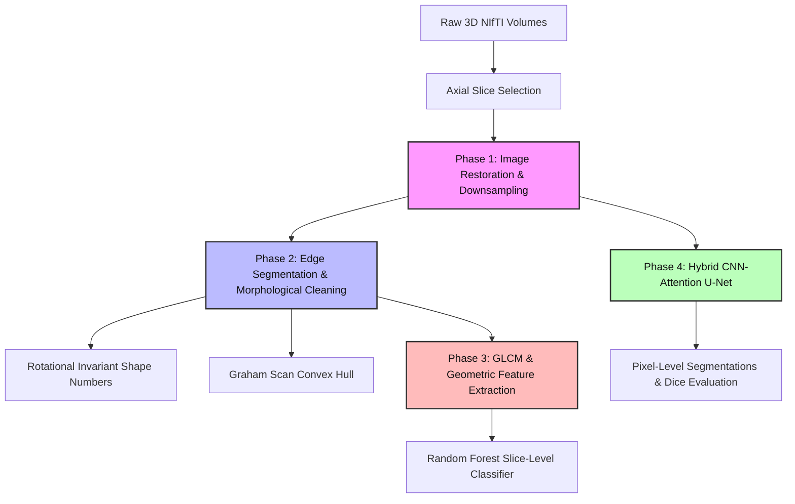
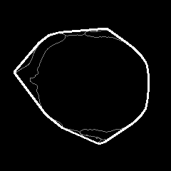
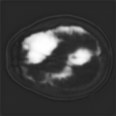

# Multimodal Brain MRI Processing & Deep Vision Pipeline

**Authors:** Shahrukh Faisal (231210) & Arham Akhtar (231152)  
**Affiliation:** Department of Artificial Intelligence  
**Date:** June 2026

---

## Project Overview

This repository implements an end-to-end medical image processing and deep learning pipeline applied to the Brain Tumor Segmentation (BraTS) pediatric dataset of 25 patients. The pipeline integrates spatial domain restoration, boundary chain coding, computational geometry (custom Graham Scan convex hulls), statistical texture analysis (GLCM), and semantic segmentation utilizing a hybrid CNN-Attention U-Net architecture.



---

## Deliverables & Results Visualizations

### 1. Image Restoration & Downsampling (Phase 1)
Evaluates spatial filters under simulated sensor noise (Gaussian and Salt-and-Pepper profiles). Downsampling is protected against checkerboard/aliasing artifacts via Gaussian pre-filtering.

| Metric | Noise Profile | Filter Applied | PSNR (dB) | SSIM |
| :--- | :--- | :--- | :---: | :---: |
| Noisy | Gaussian ($\sigma^2=0.01$) | None | 21.98 | 0.2694 |
| restored | Gaussian ($\sigma^2=0.01$) | Gaussian ($5 \times 5, \sigma=1.0$) | **26.46** | 0.5054 |
| restored | Gaussian ($\sigma^2=0.01$) | Mean ($5 \times 5$) | 24.97 | **0.5100** |
| Noisy | Salt-and-Pepper (2%) | None | 20.62 | 0.6676 |
| restored | Salt-and-Pepper (2%) | Median ($5 \times 5$) | **28.43** | **0.9201** |

---

### 2. Edge-Guided Segmentation & Convex Hulls (Phase 2)
Generates binary tumor masks using threshold-guided Canny edge detection, morphologically cleaned with an ellipsoidal structuring element. Traces contours to compute rotationally invariant 8-directional shape numbers and constructs the Convex Hull utilizing a custom Graham Scan algorithm.

<p align="center">
  
  <br>
  <em>Figure 1: Traced tumor boundary contour (Gray) vs Computed Graham Scan Convex Hull (White)</em>
</p>

---

### 3. Texture Descriptors & Traditional Classification (Phase 3)
Extracts 8 geometric and Gray-Level Co-occurrence Matrix (GLCM) statistical features (Energy, Contrast, Entropy) at distance $d=1$ across four orientations. Slices are classified as Malignant/Benign (by tumor load) using a Random Forest classifier.

**Random Forest Classification Report (5-Fold Cross-Validation):**
* **Mean CV Accuracy**: 92.00%
* **Benign**: Precision: 0.93 | Recall: 0.93 | F1-Score: 0.93 (Support: 14)
* **Malignant**: Precision: 0.91 | Recall: 0.91 | F1-Score: 0.91 (Support: 11)

---

### 4. Semantic Segmentation via Hybrid CNN-Attention U-Net (Phase 4)
Integrates a spatial self-attention block at the encoder-decoder bottleneck of a 2D U-Net to capture global voxel-to-voxel relationships. Trained on T2-FLAIR and T1-contrast enhanced slices.

<p align="center">
  
  <br>
  <em>Figure 2: Side-by-side segmentation output: Input Slice (Left), Ground-Truth Mask (Middle), CNN-Attention U-Net Prediction (Right)</em>
</p>

**Pixel-Level Validation Metrics:**
* **Dice Coefficient (F1-Score)**: 0.5037
* **Recall (Sensitivity)**: 0.8033
* **Precision**: 0.3669
* **Confusion Matrix (Validation Slices)**:
  - **True Negative (TN)**: 108,394
  - **False Positive (FP)**: 3,656
  - **False Negative (FN)**: 519
  - **True Positive (TP)**: 2,119

---

## Directory Structure

```text
├── before_after_dataset/       # Visual pipeline comparisons
│   ├── original/               # Raw axial slices
│   ├── filtered/               # Denoised MRI slices
│   ├── downsampled/            # Decimated slices (with/without AA)
│   ├── segmented/              # Morphological masks & DL predictions
│   └── convex_hull/            # Custom Graham Scan overlays
├── scratch/                    # Data dependencies and cached files
│   ├── classical_results.pkl   # Saved feature vectors and ML results
│   ├── dl_results.pkl          # Saved deep learning metrics and histories
│   └── extracted_slices.pkl    # Pre-processed patient 2D MRI slices
├── mri_analysis_pipeline.ipynb # Main Jupyter Notebook
├── research_paper.md           # Technical research report in markdown
├── research_paper.pdf          # Professional compiled PDF report
├── run_pipeline_terminal.py    # Non-interactive execution script
└── README.md                   # Repository documentation
```

---

## Setup & Running the Pipeline

### Prerequisites
Ensure Python 3.10.6 is installed. Install the package dependencies using:
```bash
pip install torch numpy opencv-python scipy matplotlib scikit-image scikit-learn fpdf2
```

### Run Notebook Verification
You can run the entire pipeline and verify all Jupyter cells sequentially in the terminal by executing:
```bash
python run_pipeline_terminal.py
```
This script bypasses interactive GUI windows (plotting directly to the `before_after_dataset` folder using the `Agg` matplotlib backend) and validates that the code executions remain clean and warning-free.
